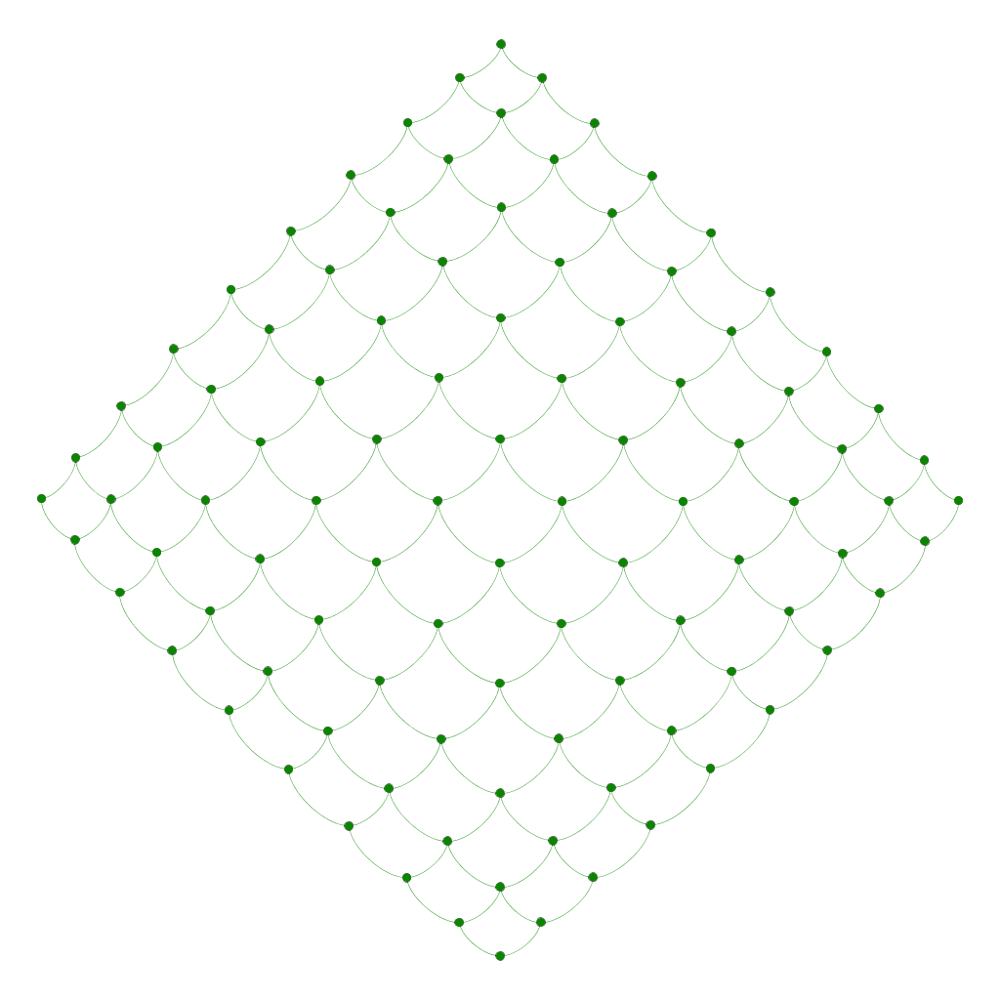
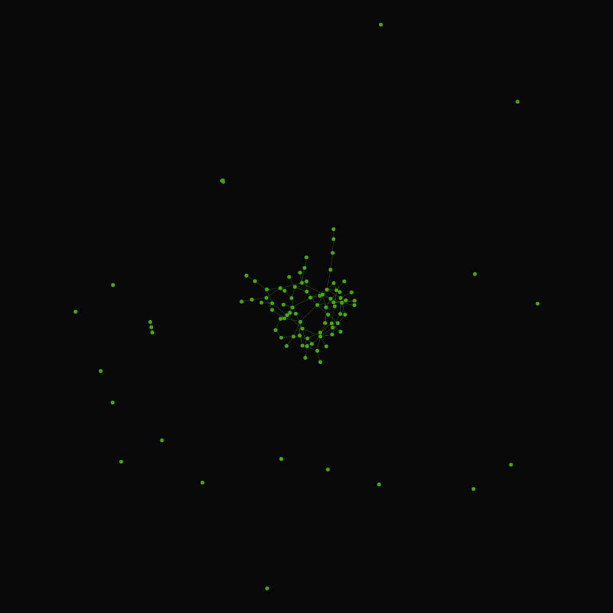
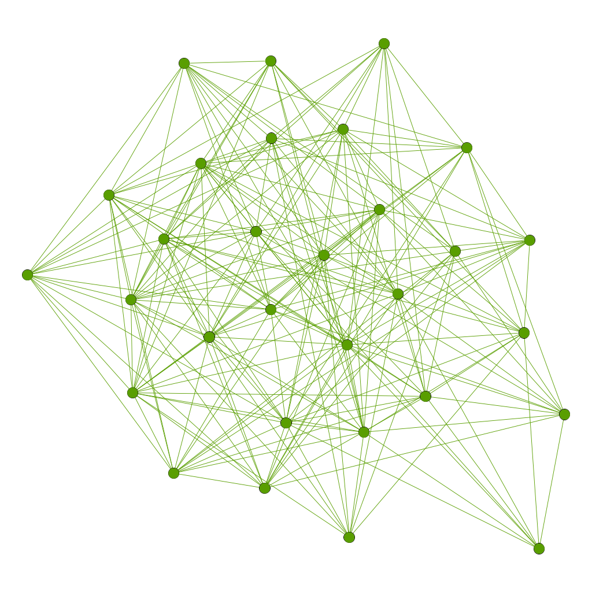
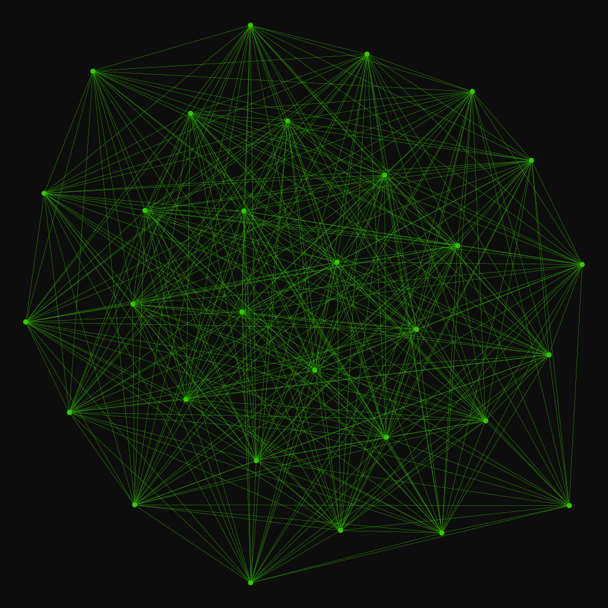
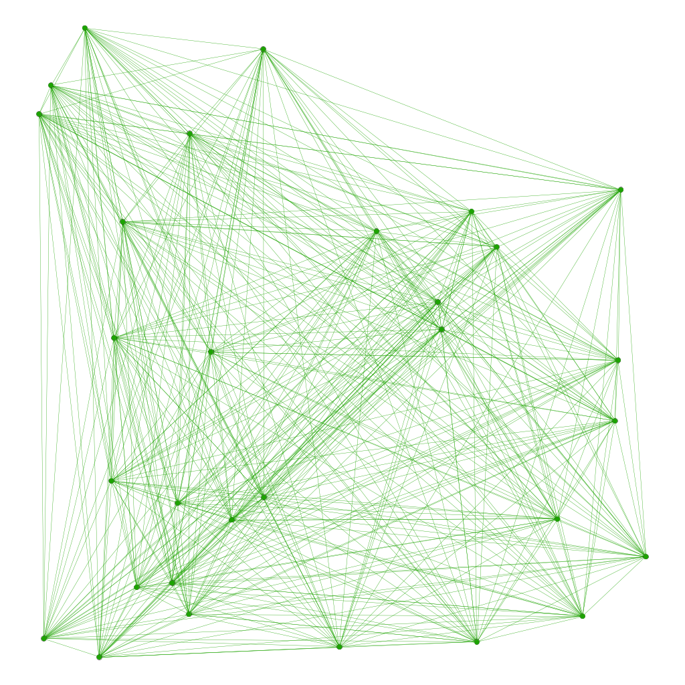
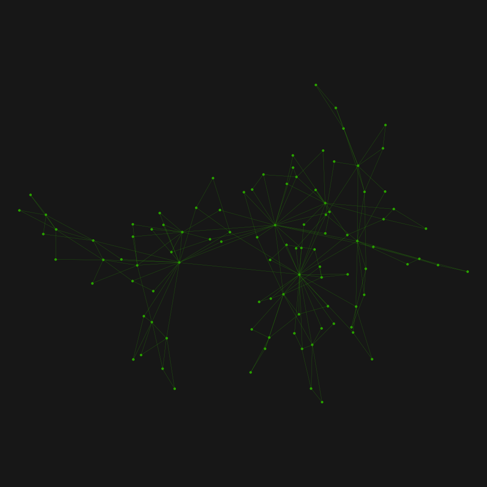
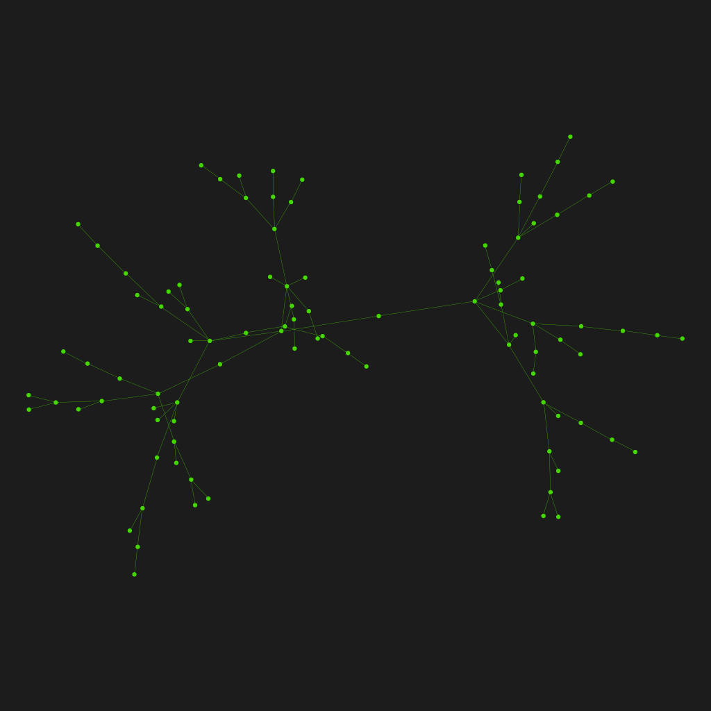
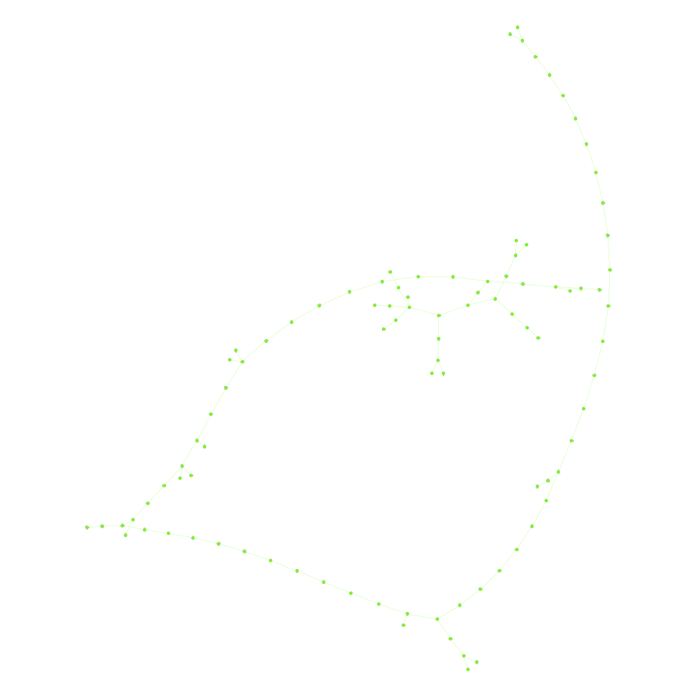

[](https://github.com/ablarry/pygraph/actions/workflows/python-publish.yml)
# pygraph
pygraph is a library to work with graphs, searches with DFS and BFS algorithms  and render with [graphviz](https://graphviz.org/) 

### Random Graphs Models
Creation of random graphs with models:

- **Mesh model**

  Graph of m*n nodes representing a meshing model.


  


- **Erdős–Rényi model** 
  
  In the G(n,p) model, a graph is constructed by connecting labeled nodes randomly. Each edge is included in the graph with probability p, independently from every other edge.
  

   

- **Gilbert model**
  
  A random graph obtained by starting with a set of n isolated vertices and adding successive edges between them at random.


  

- **Geographic model**

  Create a random graph with simple method geographic.


  


- **Barabási-Albert**
  
  The graph begins with an initial connected network of m0 nodes.
  New nodes are added to the network one at a time. Each new node is connected to m < m0 existing nodes with a probability that is proportional to the number of links that the existing nodes already have.


  

- **Dorogovtsev-Mendes**

  A graph with edge set E, and denote the degree of a vertex v (that is, the number of edges incident to v) by deg(v).
  

  

  [View all images model](images/png)


### Search graphs algorithms 

- **Breadth-first search (BFS)**

  BFS is an algorithm for traversing or searching tree or graph data structures. It starts at the tree root (or some arbitrary node of a graph, sometimes referred to as a 'search key'), and explores all of the neighbor nodes at the present depth prior to moving on to the nodes at the next depth level.


  

- **DFS Depth-first search (DFS)**

  DFS is an algorithm for traversing or searching tree or graph data structures. The algorithm starts at the root node (selecting some arbitrary node as the root node in the case of a graph) and explores as far as possible along each branch before backtracking.


  
  
  [View all images algorithms](images/png)

### Installation 

```
git clone https://github.com/ablarry/pygraph.git
```
### Quickstart
```
Available commands:
	make install Install dependencies.
	make tests   Run tests
	make linter  Execite linter
```

### Examples
- Barabási-Albert model
```python
g = models.barabasi(30, 30, True)
g.create_graphviz('Barabasi_directed_30')
```
- Gilbert model
```python
g = models.gilbert(30, 0.3)
g.create_graphviz('Gilbert_30')
```
There are more examples in [test_graph.py](/test/test_graph.py)


- Breadth-first search (BFS)
```python
g = models.erdos_rengy(100, 150)
bfs = g.bfs(0)
bfs.create_graphviz('BFS_100')
```
There are more examples in [test_bfs.py](/test/test_bfs.py)


- Depth-first search (DFS)
```python
g = models.erdos_rengy(100, 150)
dfs = g.dfs(0)
dfs.create_graphviz('DFS_100')
```

- Depth-first search (DFS) recursive
```python
g = models.erdos_rengy(100, 150)
dfs = g.dfs_r(0)
dfs.create_graphviz('DFS_R_100')
```
There are more examples in [test_dfs.py](/test/test_dfs.py)

### Test
Run test
```
make tests
```
To execute specific test
```
python -m unittest test.test_graph.TestGraph -v
```
### References:
- [Mesh model](https://en.wikipedia.org/wiki/Mesh_generation)
- [Erdős–Rényi model](https://en.wikipedia.org/wiki/Erd%C5%91s%E2%80%93R%C3%A9nyi_model)
- [Gilbert model](https://en.wikipedia.org/wiki/Random_graph)
- [Barabási-Albert](https://en.wikipedia.org/wiki/Barab%C3%A1si%E2%80%93Albert_model#Algorithm)
- [Dorogovtsev-Mendes](https://en.wikipedia.org/wiki/Barab%C3%A1si%E2%80%93Albert_model#Algorithm)
- [Breadth-first search](https://en.wikipedia.org/wiki/Breadth-first_search)
- [Depth-first search](https://en.wikipedia.org/wiki/Depth-first_search)
